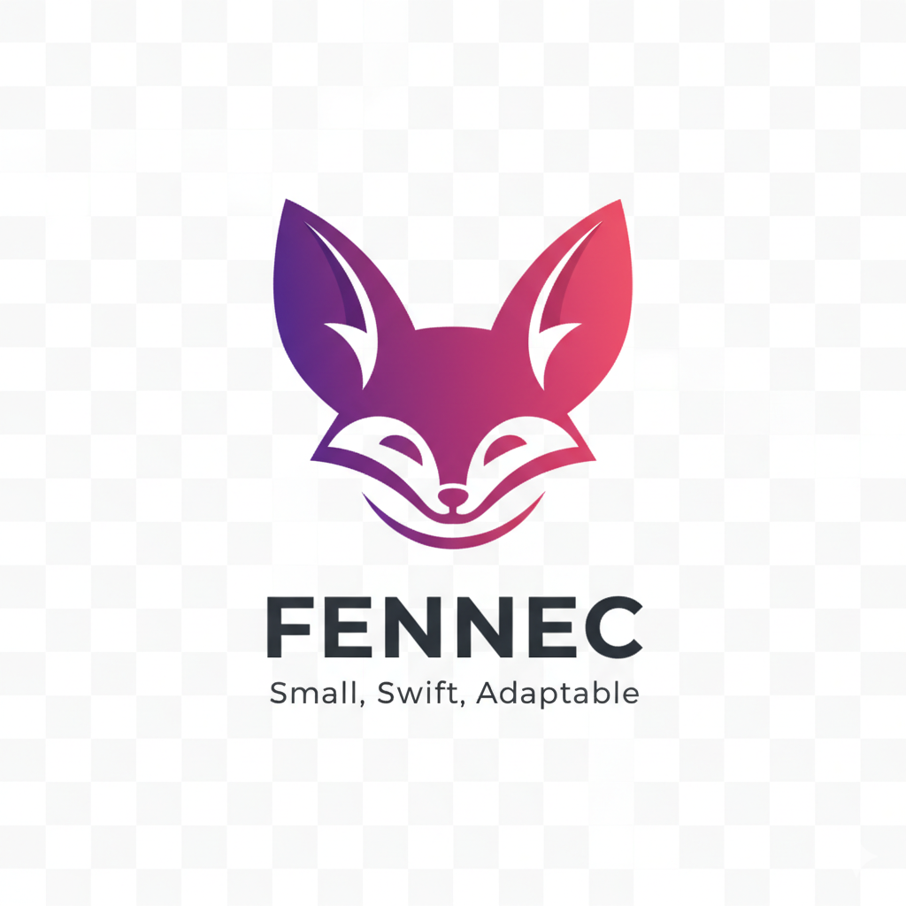

<div align="center">
  
  
  # Fennec 🦊
  
  **A lightweight, fast, and agile Python backend framework**
  
  *Named after the Fennec fox - small, swift, and adaptable*
  
  [](https://badge.fury.io/py/fennec-framework)
  [](https://www.python.org/downloads/)
  [](https://opensource.org/licenses/MIT)
  
  Built with ❤️ in Tunisia 🇹🇳
</div>

---

## 🚀 Quick Start

```bash
# Install Fennec
pip install fennec-framework

# Create your first API
from fennec import Application

app = Application(title="My API")

@app.get("/")
async def hello():
    return {"message": "Hello from Fennec! 🦊"}

# Run with: uvicorn main:app --reload
```

---

## ✨ Features

A modular, async-first Python framework for building REST APIs with minimal dependencies.

### Core Features

### Core Features
- 🚀 **Async/Await Support**: Built from the ground up with async/await
- 🔌 **Modular Architecture**: Use only what you need
- ✅ **Automatic Validation**: Type-hint based validation
- 📝 **Auto Documentation**: OpenAPI/Swagger generation
- 🧪 **Testing Utilities**: Easy-to-use test client
- 🛠️ **CLI Tools**: Project scaffolding and management commands
- 💉 **Dependency Injection**: Clean dependency management
- 🎯 **Middleware System**: Flexible request/response processing
- 🖥️ **GUI Client**: Beautiful Tkinter desktop application included!

### v0.2.0 Features
- 🔌 **WebSocket Support**: Real-time bidirectional communication
- 📊 **GraphQL Support**: Flexible API queries with GraphiQL interface
- 🔒 **Enhanced Security**: Password hashing, CSRF protection, input sanitization
- 🗄️ **Database Integration**: PostgreSQL and MongoDB examples
- 🏗️ **Microservices**: API Gateway pattern and service decomposition
- 🔐 **OAuth2 Authentication**: Complete authorization code flow
- 🐳 **Docker Ready**: Production deployment examples

### v0.3.0 Features (Production-Grade)
- 🚀 **Redis Caching**: High-performance caching with decorators and strategies
- 🗄️ **Database Migrations**: Version-controlled schema management
- 📊 **Monitoring Tools**: Prometheus metrics, distributed tracing, structured logging
- 🎛️ **Admin Dashboard**: Real-time monitoring and management interface
- 📨 **Message Queues**: Async task processing with Redis, RabbitMQ, AWS SQS
- ⚡ **gRPC Support**: High-performance RPC for microservices

## Why Fennec?

Named after the **Fennec fox** 🦊 - the smallest, fastest, and most adaptable fox species native to the Sahara Desert and Tunisia. Just like the Fennec fox, our framework is:

- 🦊 **Small & Lightweight**: Minimal dependencies, maximum efficiency
- ⚡ **Fast & Agile**: Async/await throughout for blazing performance  
- 🌍 **Adaptable**: Works for any project size, from MVP to enterprise
- 🧠 **Smart**: Elegant design with powerful features
- 🇹🇳 **Tunisian Pride**: Built with ❤️ in Tunisia

## Installation

```bash
pip install fennec-framework uvicorn
```

## Quick Start

### Create Your First API

```python
from fennec import Application, Router, JSONResponse

# Create application
app = Application(title="My API", version="1.0.0")
router = Router()

# Define routes
@router.get("/")
async def root():
    return JSONResponse(data={"message": "Hello World!"})

@router.get("/users/{id}")
async def get_user(id: int):
    return JSONResponse(data={"id": id, "name": "John Doe"})

# Include router
app.include_router(router)

# Run with: uvicorn main:app
```

### With Validation

```python
from fennec.validation import BaseModel, Field

class User(BaseModel):
    name: str = Field(min_length=2, max_length=50)
    email: str
    age: int
    
    def validate_age(self, value):
        if value < 0:
            raise ValueError("Age must be positive")
        return value

@router.post("/users")
async def create_user(request):
    data = await request.json()
    user = User(**data)  # Automatic validation
    return JSONResponse(data=user.dict(), status_code=201)
```

### With Middleware

```python
from fennec.security import CORSMiddleware, RateLimitMiddleware

# Add CORS
app.middleware_manager.add(CORSMiddleware(allow_origins=["*"]))

# Add rate limiting
app.middleware_manager.add(RateLimitMiddleware(max_requests=100, window_seconds=60))

# Custom middleware
@app.middleware("http")
async def log_requests(request, call_next):
    print(f"Request: {request.method} {request.path}")
    response = await call_next(request)
    return response
```

### With Dependency Injection

```python
from fennec.dependencies import Depends

def get_db():
    return {"users": []}

@router.get("/users")
async def list_users(db=Depends(get_db)):
    return JSONResponse(data={"users": db["users"]})
```

### With Authentication

```python
from fennec.security import JWTHandler, requires_auth

jwt = JWTHandler(secret_key="your-secret-key")

@router.post("/login")
async def login(request):
    data = await request.json()
    # Verify credentials...
    token = jwt.encode({"user_id": 1, "username": data["username"]})
    return JSONResponse(data={"token": token})

@router.get("/protected")
@requires_auth
async def protected_route(request):
    return JSONResponse(data={"message": "You are authenticated!"})
```

## CLI Tools

### Create New Project

```bash
python -m fennec.cli startproject myproject
cd myproject
python -m app.main
```

### Create New Module

```bash
python -m fennec.cli create:module users
```

### Run Development Server

```bash
python -m fennec.cli runserver --host=0.0.0.0 --port=8000
```

## API Documentation

The framework automatically generates OpenAPI/Swagger documentation for your API.

Visit `http://localhost:8000/docs` to see interactive API documentation.

## Testing

```python
import asyncio
from fennec.testing import TestClient
from main import app

async def test_api():
    client = TestClient(app)
    
    # Test GET request
    response = await client.get("/users/1")
    assert response.status_code == 200
    assert response.json()["data"]["id"] == 1
    
    # Test POST request
    response = await client.post("/users", json_data={
        "name": "John",
        "email": "john@example.com",
        "age": 30
    })
    assert response.status_code == 201

asyncio.run(test_api())
```

## Project Structure

```
myproject/
├── app/
│   ├── __init__.py
│   ├── main.py              # Application entry point
│   ├── routers/             # Route handlers
│   │   ├── __init__.py
│   │   └── users.py
│   ├── models/              # Data models
│   │   ├── __init__.py
│   │   └── user.py
│   ├── services/            # Business logic
│   │   ├── __init__.py
│   │   └── user_service.py
│   └── db/                  # Database layer
│       ├── __init__.py
│       └── repositories.py
├── tests/
│   └── test_users.py
└── README.md
```

## Core Concepts

### Application

The main application class that manages the lifecycle and ASGI interface.

```python
app = Application(title="My API", version="1.0.0", docs_enabled=True)
```

### Router

Manages routes and URL mapping.

```python
router = Router(prefix="/api/v1")

@router.get("/users")
async def list_users():
    return JSONResponse(data={"users": []})

app.include_router(router)
```

### Request & Response

```python
@router.post("/data")
async def handle_data(request):
    # Get JSON body
    data = await request.json()
    
    # Get headers
    auth = request.headers.get("authorization")
    
    # Get path parameters
    user_id = request.path_params.get("id")
    
    # Get query parameters
    page = request.query_params.get("page", 1)
    
    return JSONResponse(
        data={"result": "success"},
        message="Data processed",
        status_code=200
    )
```

### Validation

```python
from fennec.validation import BaseModel, Field

class Product(BaseModel):
    name: str = Field(min_length=1, max_length=100)
    price: float
    quantity: int = Field(default=0, required=False)
    
    def validate_price(self, value):
        if value < 0:
            raise ValueError("Price must be positive")
        return value
```

### Middleware

```python
from fennec.middleware import Middleware

class CustomMiddleware(Middleware):
    async def __call__(self, request, call_next):
        # Pre-processing
        request.custom_data = "something"
        
        # Call next middleware/handler
        response = await call_next(request)
        
        # Post-processing
        response.headers["X-Custom"] = "value"
        
        return response

app.middleware_manager.add(CustomMiddleware())
```

### Exception Handling

```python
from fennec.exceptions import HTTPException

class CustomException(HTTPException):
    def __init__(self):
        super().__init__(418, "I'm a teapot")

@app.exception_handler(CustomException)
async def handle_custom(request, exc):
    return JSONResponse(
        message=exc.message,
        status="error",
        status_code=exc.status_code
    )
```

## WebSocket Support (v0.2.0)

Build real-time applications with WebSocket support:

```python
from fennec import Application, WebSocketRouter, WebSocket, WebSocketManager

app = Application()
ws_router = WebSocketRouter()
ws_manager = WebSocketManager()

@ws_router.websocket("/ws/chat/{room}")
async def chat_room(websocket: WebSocket, room: str):
    await websocket.accept()
    client_id = await ws_manager.connect(websocket)
    ws_manager.join_room(client_id, room)
    
    try:
        while True:
            message = await websocket.receive_text()
            await ws_manager.broadcast(message, room=room)
    finally:
        await ws_manager.disconnect(client_id)

app.include_websocket_router(ws_router)
```

## GraphQL Support (v0.2.0)

Create flexible GraphQL APIs:

```python
from fennec import Application, GraphQLEngine, query, mutation

app = Application()
gql = GraphQLEngine()

# Define schema
schema = """
type User {
    id: ID!
    name: String!
    email: String!
}

type Query {
    users: [User!]!
    user(id: ID!): User
}

type Mutation {
    createUser(name: String!, email: String!): User!
}
"""

gql.set_schema(schema)

# Define resolvers
@query("users")
async def resolve_users(parent, info):
    return get_all_users()

@mutation("createUser")
async def resolve_create_user(parent, info, name: str, email: str):
    return create_user(name, email)

# Add GraphQL endpoint with GraphiQL interface
app.add_graphql("/graphql", gql, graphiql=True)
```

## Enhanced Security (v0.2.0)

Production-ready security features:

```python
from fennec.security import (
    PasswordHasher,
    SecurityHeadersMiddleware,
    CSRFMiddleware,
    InputSanitizer,
    EnhancedJWTHandler
)

# Password hashing with bcrypt
hashed = PasswordHasher.hash("password123")
is_valid = PasswordHasher.verify("password123", hashed)

# Security headers
app.middleware_manager.add(SecurityHeadersMiddleware())

# CSRF protection
app.middleware_manager.add(CSRFMiddleware(secret_key="your-secret"))

# Input sanitization
clean_html = InputSanitizer.sanitize_html(user_input)
email = InputSanitizer.validate_email(email_input)

# Enhanced JWT with refresh tokens
jwt = EnhancedJWTHandler(secret_key="your-secret")
access_token = jwt.create_access_token({"user_id": 1})
refresh_token = jwt.create_refresh_token({"user_id": 1})
new_token = jwt.refresh_access_token(refresh_token)
```

## Redis Caching (v0.3.0)

Boost performance with Redis caching:

```python
from fennec.cache import RedisCache, cache, CacheAside

# Initialize cache
redis_cache = RedisCache(url="redis://localhost:6379")

# Use decorator for automatic caching
@cache(ttl=300, backend=redis_cache)
async def get_expensive_data(user_id: int):
    # This result will be cached for 5 minutes
    return await database.query(user_id)

# Use cache-aside pattern
cache_aside = CacheAside(redis_cache, ttl=600)

async def get_user(user_id: int):
    return await cache_aside.get(
        f"user:{user_id}",
        lambda: database.get_user(user_id)
    )
```

## Database Migrations (v0.3.0)

Manage database schema changes:

```python
from fennec.migrations import MigrationManager

# Initialize migration manager
manager = MigrationManager(connection, migrations_dir="migrations")

# Create migration
await manager.create("add users table", migration_type="python")

# Apply migrations
await manager.migrate()

# Rollback
await manager.rollback(steps=1)

# Check status
status = await manager.status()
```

## Monitoring & Observability (v0.3.0)

Production-ready monitoring:

```python
from fennec.monitoring import PrometheusMetrics, RequestTracer, StructuredLogger

# Prometheus metrics
metrics = PrometheusMetrics(app_name="my_app")
app.add_middleware(MetricsMiddleware(metrics))

# Distributed tracing
tracer = RequestTracer(service_name="my_app")
app.add_middleware(TracingMiddleware(tracer))

# Structured logging
logger = StructuredLogger(name="my_app")
logger.info("User logged in", user_id=123, ip="192.168.1.1")

# Expose metrics endpoint
@app.get("/metrics")
async def metrics_endpoint(request):
    return Response(metrics.generate_metrics(), content_type=metrics.get_content_type())
```

## Admin Dashboard (v0.3.0)

Web-based monitoring interface:

```python
from fennec.admin import AdminDashboard

# Initialize admin dashboard
admin = AdminDashboard(
    app,
    auth_required=True,
    prefix="/admin"
)

# Access dashboard at http://localhost:8000/admin
# View real-time metrics, system health, and request logs
```

## Message Queues (v0.3.0)

Async task processing:

```python
from fennec.queue import QueueManager, Worker

# Initialize queue manager
queue = QueueManager(backend="redis", connection_url="redis://localhost:6379")

# Define tasks
@queue.task(queue_name="emails", max_retries=3)
async def send_email(to: str, subject: str, body: str):
    await email_service.send(to, subject, body)

# Enqueue task
await send_email("user@example.com", "Hello", "Welcome!")

# Start worker
worker = Worker(queue, queue_names=["emails"], concurrency=4)
await worker.start()
```

## gRPC Support (v0.3.0)

High-performance microservices:

```python
from fennec.grpc import GRPCServer, GRPCClient

# Server
server = GRPCServer(host="0.0.0.0", port=50051)
server.add_service(UserServiceStub, UserServicer())
await server.start()

# Client
client = GRPCClient(host="localhost", port=50051)
await client.connect()

response = await client.call(
    UserServiceStub,
    'GetUser',
    GetUserRequest(id=1)
)
```

## Examples

Check the `examples/` directory for complete working examples:

### v0.1.0 Examples
- **simple_api**: Basic CRUD API with validation and middleware

### v0.2.0 Examples
- **websocket_chat**: Real-time chat application with rooms
- **graphql_api**: GraphQL API with queries and mutations
- **microservices**: API Gateway with user and order services
- **database_integration**: PostgreSQL and MongoDB examples
- **oauth2_auth**: OAuth2 authorization code flow
- **deployment**: Docker, docker-compose, and cloud deployment

### v0.3.0 Examples
- **caching_example**: Redis caching with decorators and strategies
- **migration_example**: Database migration workflow
- **monitoring_setup**: Prometheus, tracing, and logging
- **admin_dashboard**: Real-time monitoring interface
- **message_queue**: Async task processing with workers
- **grpc_service**: gRPC microservice with Protocol Buffers

## ⚠️ Security Notice

**This framework is currently suitable for development and testing only.**

Before deploying to production, please read:
- 📋 [Production Readiness Guide](PRODUCTION_READINESS.md) - Complete roadmap to production
- 🔒 [Security Assessment](SECURITY_ASSESSMENT.md) - Current security status
- 🛡️ [Security Improvements](SECURITY_IMPROVEMENTS.md) - Step-by-step hardening guide

**Estimated time to production-ready**: 1-2 days of security hardening.

## Quick Links

- 🦊 [Meet Fennec](FENNEC_INTRO.md) - Learn about the framework and the fox!
- 👋 [Welcome Guide](WELCOME.md) - New to Fennec? Start here!
- 📖 [Quick Start Guide](QUICKSTART.md) - Get started in 5 minutes
- 🚀 [How to Run](HOW_TO_RUN.md) - Step-by-step running instructions
- 🖥️ [GUI Client Guide](GUI_CLIENT_GUIDE.md) - Desktop GUI application
- 📚 [OpenAPI Documentation Guide](OPENAPI_GUIDE.md) - How to document your API
- 🔒 [Security Assessment](SECURITY_ASSESSMENT.md) - Security status and recommendations
- 🛡️ [Security Improvements](SECURITY_IMPROVEMENTS.md) - How to harden for production
- 🎨 [Branding Guide](BRANDING.md) - Logo, colors, and brand guidelines
- 📊 [Project Summary](PROJECT_SUMMARY.md) - Complete project overview
- 🤝 [Contributing](CONTRIBUTING.md) - Contribution guidelines
- 📝 [Changelog](CHANGELOG.md) - Version history

## Requirements

- Python 3.8+
- uvicorn (for running the server)

## Development

```bash
# Install in development mode
pip install -e .

# Run quick test
python test_framework.py

# Run example (Method 1: with PYTHONPATH)
PYTHONPATH=$PWD python examples/simple_api/main.py

# Run example (Method 2: with script)
./run_example.sh

# Visit API documentation
# http://localhost:8001/docs
```

## Contributing

Contributions are welcome! Please feel free to submit a Pull Request.

## License

MIT License

## About Fennec

### The Name

Fennec (*Vulpes zerda*) is the smallest fox species, native to the Sahara Desert and North Africa, including Tunisia 🇹🇳. Known for their:
- Large ears (excellent for hearing - like our great error messages!)
- Small size (lightweight and efficient)
- Speed and agility (async performance)
- Adaptability (works in any environment)

### The Mission

To provide developers with a **simple, fast, and powerful** framework that doesn't get in the way. We believe in:
- **Simplicity over complexity**
- **Performance over features**
- **Developer experience over everything**

### Made in Tunisia 🇹🇳

Proudly built in Tunisia, showcasing North African tech talent to the world.

## Credits

**Created by**: Ghassen (Tunisia 🇹🇳)
**Inspired by**: The Fennec fox, native to the Sahara Desert
**Built with**: ❤️, Python, and lots of coffee

---

<div align="center">
  <strong>Fennec Framework 🦊</strong><br>
  Small, Swift, and Adaptable<br><br>
  <a href="BRANDING.md">Branding Guide</a> •
  <a href="CONTRIBUTING.md">Contributing</a> •
  <a href="LICENSE">License</a>
</div>
